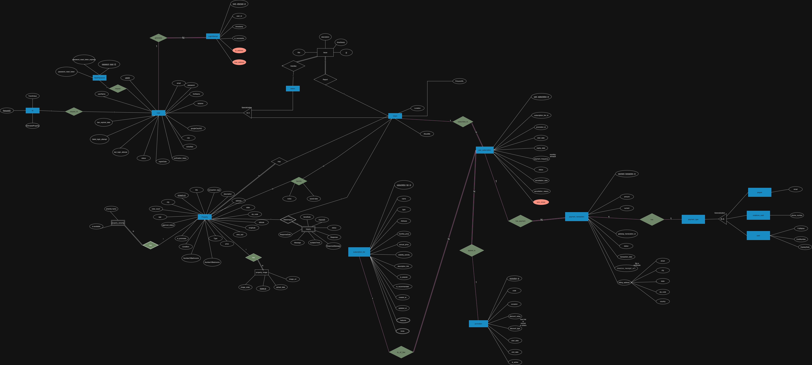
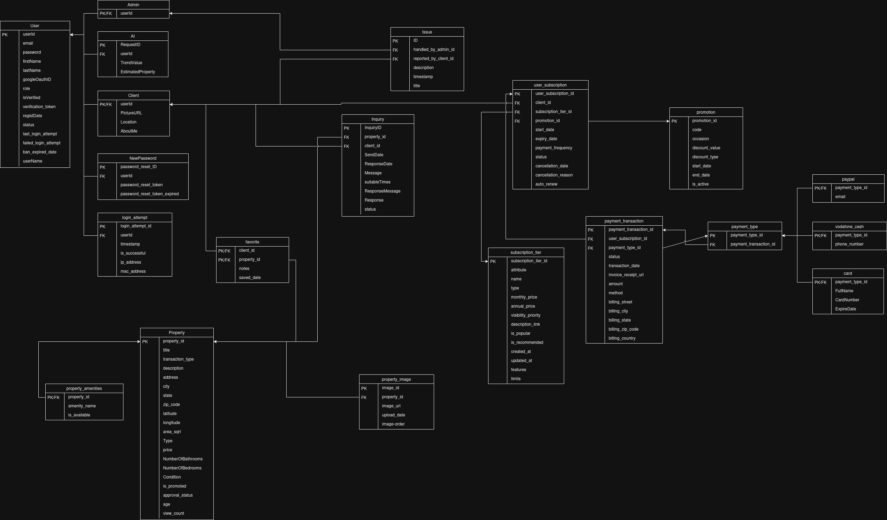

# Homosphere

Homosphere is a full-stack real estate platform for buyers, sellers, brokers, and admins.  
It combines property discovery, listing management, subscriptions, payments, admin review workflows, and AI-assisted price prediction.

## Application Overview

### Core modules
- **Frontend (`homosphere-frontend`)**: React + Vite web app with role-based flows, property search, maps, profile management, and admin pages.
- **Backend (`homosphere-backend`)**: Spring Boot REST API with authentication, property/listing workflows, media handling, subscriptions, analytics, and admin operations.
- **AI service (`homosphere-ai`)**: FastAPI service for house price prediction and ZIP-based trend adjustments.

### Main product capabilities
- User signup/login (including Google signup flow), profile retrieval, and role-aware access.
- Public and authenticated property browsing with advanced filtering, sorting, and map points.
- Property listing creation/editing/submission with moderation and status transitions.
- Buyer save/favorite behavior and dedicated saved listings retrieval.
- Viewing request workflows between buyers and sellers.
- Subscription tier management and PayPal checkout/capture flow.
- Admin user management, property approval pipelines, and analytics endpoints.
- Media upload and retrieval for property assets.

## Architecture and Data Diagrams

### Entity Relationship Diagram


### Relational Diagram


## Product Demo Videos


### Buyer flow
<video controls preload="metadata" width="960">
  <source src="docs/buyer-edit.mp4" type="video/mp4">
</video>

### Seller flow
<video controls preload="metadata" width="960">
  <source src="docs/seller-cut.mp4" type="video/mp4">
</video>

### Admin flow
<video controls preload="metadata" width="960">
  <source src="docs/admin.mp4" type="video/mp4">
</video>

## Repository Structure

```text
homosphere/
├─ homosphere-frontend/   # React + Vite client
├─ homosphere-backend/    # Spring Boot API
├─ homosphere-ai/         # FastAPI ML service
├─ docs/                  # Diagrams and demo videos
├─ docker-compose.yml     # Multi-service container setup
└─ justfile               # Local setup and run commands
```

## Local Development

### Prerequisites
- Node.js (for frontend)
- Java 21 + Maven (for backend)
- Python 3.11 (for AI service)
- `just` (optional, but recommended)

### 1. Configure environment files

1. Backend:
   - Copy `application.properties.template` values into `homosphere-backend/src/main/resources/application.properties`.
   - Provide database, Supabase JWT/admin, Cloudflare R2, CORS, and PayPal configuration.
2. Frontend:
   - Create `homosphere-frontend/.env` with:
     - `VITE_SUPABASE_URL`
     - `VITE_SUPABASE_PUBLISHABLE_KEY`
     - `VITE_API_BASE_URL` (optional, defaults to `http://localhost:8080`)
3. AI service:
   - Add `homosphere-ai/.env` if your deployment/configuration requires it.

### 2. Install dependencies

```bash
just setup
```

### 3. Run services

```bash
# Frontend (Vite on localhost:3000)
just run-fe

# Backend (Spring Boot on localhost:8080)
just run-be
```

Run the AI service separately:

```bash
cd homosphere-ai
pip install -r requirements.txt
uvicorn main:app --host 0.0.0.0 --port 8000
```

## Docker

You can run frontend, backend, and AI services together with Docker Compose:

```bash
docker compose up --build
```

## Contributers
- Ahmed Ali Hassan
- Ahmed Farag Elsayed
- Moamen Hesham Mohammed
- Mohand Sayed Ahmed
- Yousef Khamis Abo-Elmagd
